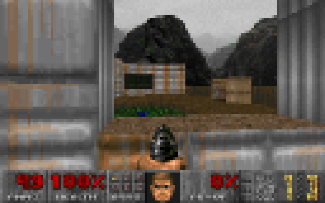
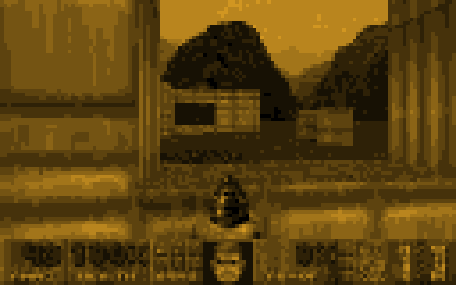

# DOOM for Drawdy

The real DOOM (1993), playable on a [Drawdy](https://drawdy.io) board. Not a
screenshot, not an embed — the game runs inside the extension and every frame
is pushed onto the canvas as live scene elements. **The board is the display.**



The whole thing is one 2 MB `.drawdyx`: engine, shareware WAD and driver. No
network, no data files, no install steps beyond dropping it into Drawdy.

---

## How it works

```
 ┌──────────────────────── Drawdy driver worker ────────────────────────┐
 │                                                                      │
 │   doom.wasm ──drawFrame──▶ 640×400 BGRA ──▶ encode ──▶ one element   │
 │      ▲                                          │                    │
 │      │ reportKeyDown/Up                         │                    │
 │      │                                          ▼                    │
 └──────┼──────────────────────────────── command:scene:update-…────────┘
        │                                          │
   control keys                                    ▼
   + console webview                        the board draws it
```

### The engine

[`jacobenget/doom.wasm`](https://github.com/jacobenget/doom.wasm) is id
Software's DOOM sources, by way of doomgeneric, compiled to a **single
freestanding WebAssembly module**. Its entire contract is four exports
(`initGame`, `tickGame`, `reportKeyDown`, `reportKeyUp`) and ten imports. No
DOM. No WASI. Nothing to emulate.

That is what makes this possible at all: Drawdy runs every driver together in
one shared worker, off the main thread, and this module runs there unmodified.
The shareware WAD is embedded inside the wasm, so there is no game data to ship
alongside it.

Two things needed care:

**Time.** `tickGame` busy-waits inside the wasm until `timeInMilliseconds`
says a new game tic is due. Handing it the real clock would spin a worker
shared with every other driver on the board. So the clock is virtual: it jumps
forward exactly one tic before each `tickGame`, so the wait is already
satisfied and returns immediately. Every query also nudges it a hair, so any
wait we did not anticipate still terminates, and a query counter unwinds a
wedged tic instead of freezing the worker.

**Pace.** Real elapsed time is converted into whole tics, capped at three per
turn, so the game keeps wall-clock speed even when drawing a frame is slow —
and the loop schedules against a *deadline* rather than sleeping a tic after
its work, which would otherwise make the real period `tic + work` and feed
back into the catch-up logic.

### The display

Drawdy has no per-frame pixel surface, so DOOM's frame buffer has to become
scene elements. Both ways of doing that are implemented.

**Shape grid** (the default, and what actually works today). One canvas
rectangle per "pixel", up to 213×133 of them. Element objects are allocated
once and mutated in place, so a frame costs no garbage, and only cells whose
*quantised* colour changed are sent — dithering noise does not count as
movement. Standing still in a corridor sends nothing at all.

**Full resolution** — implemented, and rejected by the host. Preview elements
may not be images — `DrawdyPreviewElementSchema` excludes that type — but they
*may* be `component` elements, and a component carries a whole
`DomElementSchema` whose `image` node takes an image URL. One preview component
holding one encoded frame would be DOOM at its native 640×400, with a frame
costing a *single* element update.

Drawdy accepts that component at create time and hands back a `previewId` —
and then never adds it to the live set, so every subsequent update matches
zero elements and the board shows only the black backdrop behind it. The code
is still here because it is a one-line switch if a future build draws them, but
it is no longer the default and it no longer waits to be discovered: the mount
echoes one update back at the component and treats `updated: 0` as proof, so
the driver falls back to the grid before the player sees anything wrong.

### Colour is a performance setting

The grid sends a cell when its *quantised* colour changes, so collapsing three
channels onto one luminance ramp cuts the traffic as well as the palette.
Measured over 600 identical gameplay frames at 128×80 (`node
test/palette-bench.mjs`):

| palette | cells changed per frame | of the grid | vs colour |
| --- | --- | --- | --- |
| Colour | 5,242 | 51% | 100% |
| Monochrome, 16 shades | 2,801 | 27% | 53% |
| Monochrome, 12 shades | 2,242 | 22% | 43% |
| Monochrome, 8 shades | 1,565 | 15% | **30%** |

Amber CRT and green phosphor are the same ramp with a tint, and cost exactly
the same. A third of the traffic, and it still reads perfectly as DOOM.



*Amber, 12 shades, 128×80 — 1,160 of 10,240 cells change per frame.*

The frames are **preview** elements: they render without committing, so playing DOOM never touches undo, never syncs to collaborators
and never ends up in the saved document. Switch modes from the console or
right-click → **DOOM** → **Display**.

### Input

`subscription:keyboard:control-keys` is the only keyboard a driver gets. It
reports exactly eleven keys — arrows, space, enter, tab, escape, backspace,
delete, shift — with modifier flags, no letters, no digits, and **it never
reports a key release**.

So holds are synthesised: a press is held long enough to bridge the OS's
initial key-repeat delay and re-armed by the repeats that follow, which is what
makes a held arrow walk smoothly instead of stuttering once at the start. Alt
is passed straight through as DOOM's own strafe modifier rather than being
translated into strafe keys. Enter sends `USE` alongside `ENTER`: in a menu the
`ENTER` selects and the `USE` is inert, in the game the `USE` opens the door and
the `ENTER` is inert, so one key covers both without the player having to think
about which mode they are in.

For the full keyboard, focus the **console** — a webview is a real document, so
it sees genuine keydown *and* keyup for every key, including the weapon digits.

## Controls

| From the board | |
| --- | --- |
| `↑` `↓` | Walk forward / back |
| `←` `→` | Turn |
| `Alt` + `←` `→` | Strafe |
| `Shift` | Run |
| `Space` | Fire |
| `Shift` + `Space` | Use / open doors |
| `Enter` | Confirm in menus, use in game |
| `Ctrl` + `↑` `↓` | Cycle weapons |
| `Tab` / `Esc` / `Backspace` | Automap / menu / back |

**With the console focused** you get vanilla DOOM plus WASD: digits `1`–`7`
pick weapons, `Ctrl` fires, `Space` opens, `,` `.` strafe.

The console also has on-screen Fire / Use / Map / Menu buttons and a weapon
row, so the game is playable with the mouse alone.

## Install

Grab `drawdy-doom.drawdyx` from the
[releases](https://github.com/omarthailand2231/drawdy-doom/releases) and install
it into Drawdy. That single zip is the extension.

## Develop

```bash
npm install
npm run dev            # vite on http://localhost:5174
```

Then in Drawdy, on a **local** board: `⌘K` → **Add extension dev server** →
`localhost:5174`. It hot-reloads on save.

```bash
npm run build          # dist/drawdy-doom.drawdyx
npm run typecheck
node test/render-demo.mjs 700 medium   # engine + display, headless, writes PNGs
node test/host-sim.mjs 8               # the packaged bundle against a fake host
```

`test/host-sim.mjs` is the useful one: it loads `dist/main.js` — the exact
CommonJS bundle that ships inside the `.drawdyx` — implements the slice of DDP
the driver uses, and plays it like a person would. The wasm really is decoded,
inflated and compiled; DOOM really boots; and the output PNG is reconstructed
purely from the preview-element updates the driver issued, so it is literally
what a board would be showing.

The engine is fetched at build time from a pinned release and verified by
SHA-256 (`scripts/fetch-doom-wasm.mjs`), then gzipped and base64'd into the
bundle. It is not committed to this repo.

## Other WADs

The shareware episode is built in. The console's **Load a different WAD**
picker takes any IWAD you own — `DOOM.WAD`, `DOOM2.WAD`, `freedoom.wad` — and
restarts the game on it. Nothing is uploaded anywhere; the file goes straight
from the picker into the wasm module's `readWads` import.

## Saves and settings

DOOM's own six save slots work, persisted per device through
`command:kv-storage:*`. Its save hooks are synchronous C calls and Drawdy's
storage is an async command, so slots live in memory and mirror out behind
them; they are hydrated at boot, so yesterday's save is in the load menu today.

## Licence

GPL-2.0-or-later. The DOOM source release is GPL, this bundles a compiled copy
of it, so the whole thing is. See [LICENSE](LICENSE) and [NOTICE](NOTICE).

DOOM and id Software are trademarks of id Software LLC / ZeniMax Media. This
project is not affiliated with or endorsed by either.
